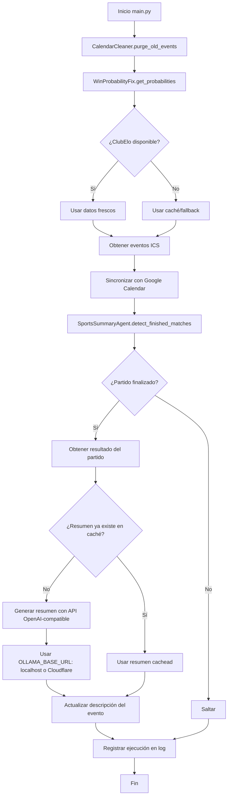

# Capa 3 - Plan de Implementación

**Proyecto:** FC Barcelona Calendar Bot  
**Versión:** 3.1.0  
**Fecha:** 2026-04-04  
**Arquitecto:** Roo (Perfil ARQUITECTO)

---

## 1. VISIÓN GENERAL

Este plan describe las fases de implementación para la refactorización del bot de calendario del FC Barcelona, basándose en los requisitos técnicos definidos en `00_REQUIREMENTS.md`. El objetivo es transformar el código monolítico actual (`bot_barca.py`) en una arquitectura modular, resiliente y mantenible, utilizando **Python 3.12** y **Pydantic v2.10+**.

**Duración estimada:** 4-6 semanas (dependiendo de disponibilidad)  
**Enfoque:** Migración incremental, manteniendo el bot operativo en todo momento.

---

## 2. FASES DE IMPLEMENTACIÓN

### Fase 0: Preparación del Entorno (Semana 1)
**Objetivo:** Establecer las bases técnicas y de infraestructura para el desarrollo.

| Tarea | Descripción | Entregable |
|-------|-------------|------------|
| **0.1** | Actualizar el workflow de GitHub Actions a Python 3.12 | `.github/workflows/run_bot.yml` modificado |
| **0.2** | Crear `pyproject.toml` con dependencias modernas (Pydantic v2.10+, httpx, pydantic-settings, openai) | `pyproject.toml` |
| **0.3** | Configurar entorno de desarrollo local con `uv` o `venv` | Script de activación |
| **0.4** | Estructurar el directorio `src/` según el esquema de módulos | Directorios `src/calendar_cleaner/`, `src/win_probability_fix/`, `src/sports_summary_agent/` |
| **0.5** | Configurar logging estructurado (JSON en producción, legible en desarrollo) | `src/shared/logging_config.py` |
| **0.6** | Crear configuración centralizada con `pydantic-settings` incluyendo `OLLAMA_BASE_URL` | `src/shared/config.py` |

### Fase 1: Módulo CalendarCleaner (Semana 2)
**Objetivo:** Refactorizar la función `limpiar_eventos_viejos` en un módulo independiente con validación Pydantic y purgado optimizado.

| Tarea | Descripción | Entregable |
|-------|-------------|------------|
| **1.1** | Diseñar modelos Pydantic para eventos de Google Calendar y configuración | `src/calendar_cleaner/models.py` |
| **1.2** | Implementar cliente de Google Calendar con métodos para listar y eliminar eventos por lotes | `src/calendar_cleaner/cleaner.py` |
| **1.3** | Añadir lógica de retención configurable (por defecto 7 días) | Configuración en `src/shared/config.py` |
| **1.4** | Escribir tests unitarios con mocks de la API de Google | `tests/calendar_cleaner/test_cleaner.py` |
| **1.5** | Integrar el módulo en el flujo principal (sustituyendo `limpiar_eventos_viejos`) | Modificación controlada en `bot_barca.py` |
| **1.6** | Validar en entorno de staging (dry‑run) que no elimina eventos incorrectos | Log de validación |

### Fase 2: Módulo WinProbabilityFix (Semana 3)
**Objetivo:** Reemplazar `obtener_probabilidades_barca` con un cliente resiliente que implemente graceful degradation.

| Tarea | Descripción | Entregable |
|-------|-------------|------------|
| **2.1** | Modelar la respuesta de ClubElo con Pydantic, incluyendo validación de columnas | `src/win_probability_fix/models.py` |
| **2.2** | Implementar cliente HTTP con reintentos exponenciales y timeout configurable | `src/win_probability_fix/clubelo_client.py` |
| **2.3** | Añadir sistema de caché en memoria (TTL = 1 hora) usando `cachetools` | `src/win_probability_fix/cache.py` |
| **2.4** | Diseñar la lógica de degradación elegante: caché → fallback → diccionario vacío | `src/win_probability_fix/graceful_degradation.py` |
| **2.5** | Escribir tests que simulen fallos de API y verifiquen el comportamiento de fallback | `tests/win_probability_fix/test_graceful_degradation.py` |
| **2.6** | Integrar el nuevo cliente en el flujo principal, manteniendo compatibilidad con el formato de salida | Actualización de `bot_barca.py` |
| **2.7** | Ejecutar pruebas de integración con la API real (modo monitorizado) | Reporte de latencia y tasa de éxito |

### Fase 3: Módulo SportsSummaryAgent (Semana 4)
**Objetivo:** Desarrollar el agente generador de resúmenes post‑partido usando inferencia local gratuita (nodo Edge Mac Mini) mediante API OpenAI‑compatible (Ollama/LocalAI).

| Tarea | Descripción | Entregable |
|-------|-------------|------------|
| **3.1** | Investigar y seleccionar fuente de resultados de partidos (Football‑Data.org, ESPN scraping, etc.) | Documento de decisión |
| **3.2** | Implementar cliente OpenAI‑compatible que use `OLLAMA_BASE_URL` variable de entorno para `base_url` | `src/sports_summary_agent/openai_client.py` |
| **3.3** | Diseñar prompt optimizado que genere exactamente 3 bullet points en español con contexto de campeonato | `src/sports_summary_agent/prompts.py` |
| **3.4** | Crear el orquestador que detecte partidos finalizados, obtenga resultado, llame a la API y actualice evento | `src/sports_summary_agent/summarizer.py` |
| **3.5** | Implementar sistema de caché permanente para evitar regenerar resúmenes ya creados | `src/sports_summary_agent/cache.py` |
| **3.6** | Escribir tests unitarios con respuestas simuladas de API OpenAI‑compatible | `tests/sports_summary_agent/test_summarizer.py` |
| **3.7** | Integrar el agente en el flujo principal como opción configurable (variable `SUMMARY_ENABLED`) | Modificación en `bot_barca.py` |
| **3.8** | Configurar pruebas de conexión con nodo Edge local (`localhost:11434`) y túnel Cloudflare | Script de validación de conectividad |

### Fase 4: Integración y Migración (Semana 5)
**Objetivo:** Unificar los tres módulos en una arquitectura coherente y migrar el código legacy.

| Tarea | Descripción | Entregable |
|-------|-------------|------------|
| **4.1** | Crear un script de entrada (`main.py`) que orqueste los módulos según configuración | `src/main.py` |
| **4.2** | Refactorizar `bot_barca.py` para usar los nuevos módulos, manteniendo compatibilidad con el flujo actual | `bot_barca.py` (versión refactorizada) |
| **4.3** | Actualizar el workflow de GitHub Actions para usar `main.py` en lugar de `bot_barca.py` | `.github/workflows/run_bot.yml` |
| **4.4** | Realizar pruebas de regresión (ejecutar el bot en un calendario de prueba) | Reporte de regresión |
| **4.5** | Optimizar el logging para que sea más informativo y estructurado | Logs en formato JSON en producción |
| **4.6** | Documentar la nueva API interna y los puntos de extensión | `docs/architecture.md` |

### Fase 5: Despliegue y Monitorización (Semana 6)
**Objetivo:** Poner en producción la nueva versión y establecer mecanismos de monitorización.

| Tarea | Descripción | Entregable |
|-------|-------------|------------|
| **5.1** | Desplegar en entorno de producción (rampa gradual del 10% al 100% de las ejecuciones) | Plan de despliegue |
| **5.2** | Configurar alertas básicas (Slack/Email) para fallos críticos (ej. Google Auth, inferencia Edge) | Script de alertas |
| **5.3** | Monitorizar disponibilidad del nodo Edge y latencia de inferencia | Dashboard de métricas |
| **5.4** | Recoger métricas de rendimiento (tiempo de ejecución por módulo, tasa de éxito de APIs) | Métricas en logs |
| **5.5** | Realizar una revisión post‑implementación y ajustar parámetros (TTL de caché, días de retención) | Informe de optimización |
| **5.6** | Actualizar la documentación de usuario (`README.md`) con las nuevas características | `README.md` actualizado |

---

## 3. DIAGRAMA DE FLUJO (ARQUITECTURA FINAL)

---

## 4. CRITERIOS DE ÉXITO POR FASE

- **Fase 0:** El bot se ejecuta sin errores en Python 3.12 con las nuevas dependencias (incluyendo `openai`).
- **Fase 1:** CalendarCleaner elimina eventos antiguos correctamente, sin afectar a eventos futuros o de otros calendarios.
- **Fase 2:** WinProbabilityFix mantiene una tasa de éxito >95% incluso con caídas simuladas de ClubElo.
- **Fase 3:** SportsSummaryAgent genera resúmenes coherentes con coste cero utilizando el nodo Edge Mac Mini.
- **Fase 4:** El bot refactorizado pasa todas las pruebas de regresión y el flujo de GitHub Actions sigue pintando de verde.
- **Fase 5:** El bot opera en producción con cero incidencias críticas durante una semana.

---

## 5. RIESGOS Y MITIGACIONES

| Riesgo | Impacto | Probabilidad | Mitigación |
|--------|---------|--------------|------------|
| **Cambios en la API de ClubElo** | Alto | Media | Usar validación Pydantic + columnas dinámicas; mantener fallback a caché. |
| **Indisponibilidad del nodo Edge** | Medio | Media | Implementar degradación elegante: si la inferencia falla, omitir resúmenes sin romper el flujo. |
| **Incompatibilidad con Python 3.12** | Bajo | Baja | Ejecutar tests en CI con múltiples versiones de Python (3.9, 3.12). |
| **Pérdida de eventos durante la migración** | Alto | Baja | Realizar copia de seguridad del calendario antes del despliegue; usar modo dry‑run en CalendarCleaner. |
| **Degradación del rendimiento** | Medio | Media | Perfilar cada módulo y optimizar llamadas a API (batch, caché). |
| **Problemas de conectividad con túnel Cloudflare** | Medio | Baja | Usar timeouts cortos y reintentos; permitir fallback a `localhost` en desarrollo. |

---

## 6. PRÓXIMOS PASOS INMEDIATOS

1. **Revisar y aprobar** este plan con el equipo.
2. **Crear issues** en el repositorio para cada tarea de la Fase 0.
3. **Configurar branch de desarrollo** (`feat/capa3-refactor`) y proteger `main`.
4. **Iniciar la implementación** siguiendo el orden de las fases.

---

*Plan elaborado por el arquitecto para guiar la implementación de la Capa 3. Cualquier desviación debe ser documentada y comunicada.*